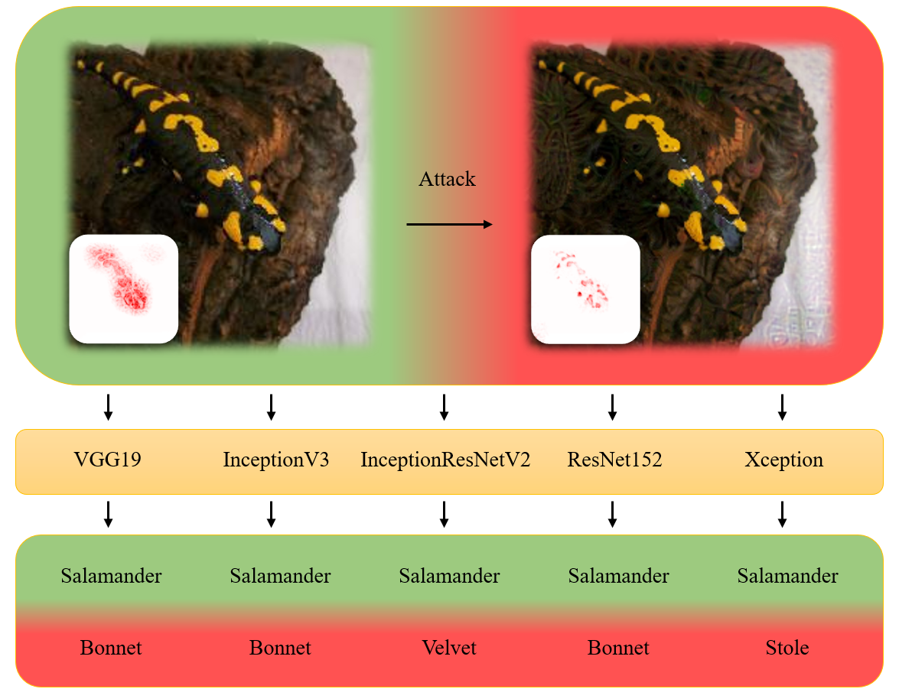

# Description
* DAmageNet is generated in paper "Universal Adversarial Attack on Attention and the Resulting Dataset DAmageNet", [IEEE TPAMI](https://ieeexplore.ieee.org/document/9238430).
* DAmageNet is a massive dataset containing universal adversarial samples generated from ImageNet.
* DAmageNet contains 50000 224\*224 images, whose original images have been centrally cropped and resized.
* DAmageNet images have an average root mean square deviation of around 7.32 from original samples.
* DAmageNet can fool pretrained models in ImageNet to have error rate up to 85%.
* DAmageNet can fool adversariral-trained models in ImageNet to have error rate up to 70%.

# Test
* Prepare [DAmageNet](http://www.pami.sjtu.edu.cn/Show/56/122), unzip to this folder as 'DAmageNet' and test by
```
python test.py DAmageNet VGG19,ResNet50,DenseNet121 [gpu_id]
```
* Each file in DAmageNet has the same name as in ILSVRC2012_img_val.

# Generation
* Prepare [ImageNet validation set (2012)](http://www.image-net.org), place in folder 'ILSVRC2012_img_val'
* Prepare the environment as in test.py
* Copy base.py to the path in iNNvestigate


* run

```
python damagenet.py 0 50000 [gpu_id]
```
* See details in attack, run

```
python damagenet.py 0 100 [gpu_id]
```

# Demo
* Reproduce the result of Fig. 4 in the paper, run
```
python lrp.py
```




# Authors
* Sizhe Chen, sizhe.chen@sjtu.edu.cn
* Zhengbao He, lstefanie@sjtu.edu.cn
* Chengjin Sun, sunchengjin@sjtu.edu.cn
* Jie Yang, jieyang@sjtu.edu.cn
* Xiaolin Huang\*, xiaolinhuang@sjtu.edu.cn
* Authors work in Institute of Image Processing and Pattern Recognition, Shanghai Jiao Tong University.
